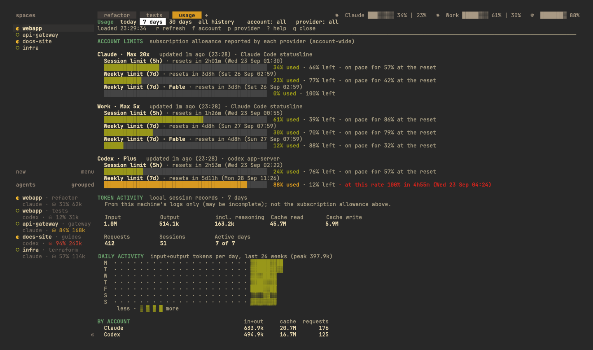
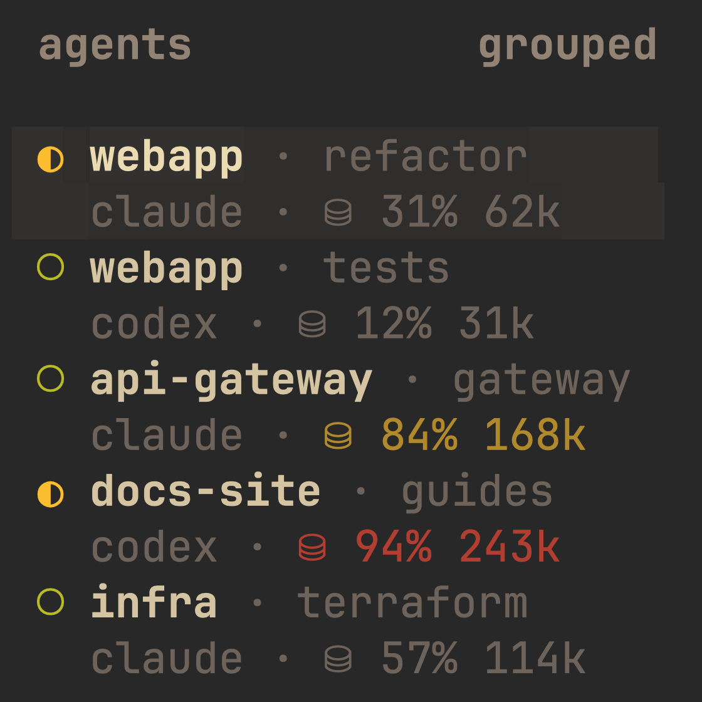
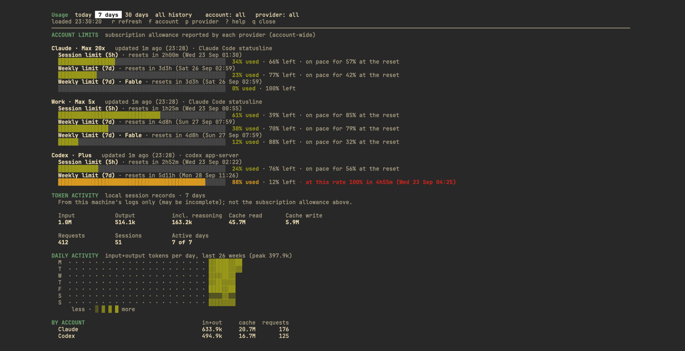
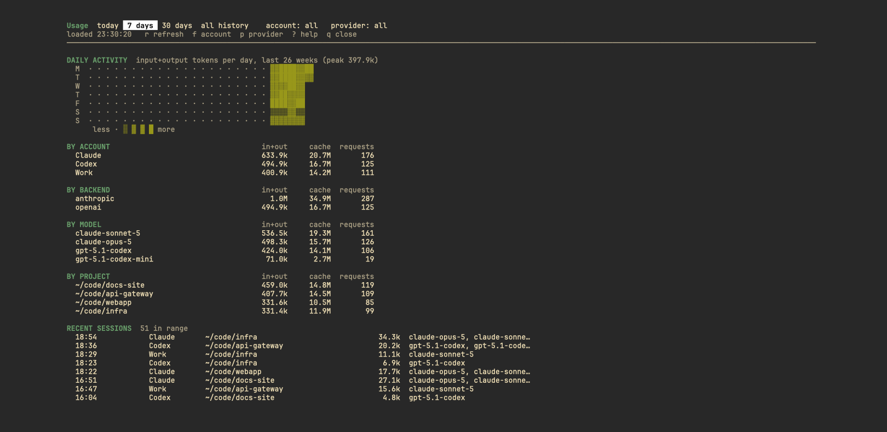

# Usage Tracker for Herdr

[](https://github.com/OWNER/herdr_agents_tracker/actions/workflows/tests.yml)
[](https://herdr.dev)
[](https://www.python.org/downloads/)
[](LICENSE)

Persistent AI account usage at the top-right of Herdr's tab bar, a context meter for each agent in
Herdr's Agents panel, alerts before a limit runs out, and a detailed terminal dashboard in a
temporary popup.



*All screenshots use demo accounts and made-up numbers.*

```
 1  2  +          ✻ ██░░░░░░ 21% 1h52m | 20% 1d11h | 0% Fable   >_ ██████░░ 76% 5d20h
```

Each account shows `<logo> <bar> <% used> <time until reset>`, one `|`-separated group per limit
window; a model's own limit shows its name instead of a reset time (`0% Fable`). The logo is the
account's `icon`: `✻` for Claude and `>_` for Codex by default. With a Nerd Font, `icon = "\uEC82"`
and `icon = "\uEC81"` are the Claude and OpenAI logos; `icon = ""` shows the account name. Accounts
that share a logo also show their names. A terminal font's "Mono" variant shrinks icons to one
narrow cell (smaller than a capital letter); to draw just the logos larger, map them to the regular
variant, e.g. in Ghostty `font-codepoint-map = U+EC81-U+EC82=JetBrainsMono Nerd Font`. Nerd Font
logos are followed by two spaces so the larger icon has room. Text size itself is the terminal's one
font size.


`format = "split"` (per account or for all) shows the 5-hour and weekly windows together in one
bar split horizontally: the top half of each cell is the 5-hour window, the bottom half the weekly
one (e.g. `██▀▀▀▀░░` is 81% of the 5-hour window and 24% of the week). `compact` shows one window
(the highest by default) and `detailed` every window, with one bar for the first (the 5-hour one when
there is one), since the others show their percentage anyway.

Herdr 0.8.2 draws tab-bar command output as plain text in the tab bar's own color (ANSI color codes
appear literally and entries have no color setting), so these bars have one color.
`status.bar = "color"` shows emoji squares instead, which the terminal colors by itself: 🟩 under
70% used, 🟨 from 70%, 🟥 from 90%. `"none"` hides the bar. The dashboard's bars use real colors
(the same green / yellow / red) on a solid dark track.

**Pace.** Once a tenth of a window has passed, the plugin projects its average rate so far: when a
limit would reach 100% before it resets, the tab bar says so, e.g. `88% 5d18h (100% in 4h05m)`, and
the dashboard adds "at this rate 100% in 4h05m (21:27)" or, when it lasts, "on pace for 61% at
the reset". No forecast is made from stale data.

**Alerts.** A Herdr notification when a limit passes `alerts.thresholds` (80% and 95% used by
default; `[]` turns alerts off), once per threshold and window, e.g. "Codex 7d limit at 88%.
Resets in 5d18h (Mon 11:25). At this rate 100% in 4h05m." Delivery follows Herdr's own
`[ui.toast] delivery` (`"herdr"` in-app, `"system"` desktop notifications, off by default);
setup mentions it when notifications are off.

### Context meters in the Agents panel



Each Claude Code and Codex agent shows how much of its context window its conversation fills, and
how many tokens that is: calm grey, yellow from 70%, red from 90%. `context.icon` sets the
symbol: `⛁` by default, the one Claude Code's `/context` uses (with a Nerd Font, `"\uEACE"` is its
database icon). Claude Code panes are updated by the statusline bridge (setup's
`--claude-statusline`) at each reply, and also after each turn, after setup and when Herdr
starts, from the transcript of the session their
`claude` process records in `~/.claude/sessions/<pid>.json`. The transcript does not say how large
the window is, so until the bridge has reported it (a session past 200k tokens has the 1M window)
such a meter shows only the tokens, e.g. `⛁ 118k`. Codex panes are updated after each turn, from
the token counts in the session file their `codex` process has open (its main thread, not
subagents). Only token counts are read, never the conversation. The meter sits after the agent name in Herdr's
default rows, or as a row of its own after rows you set yourself; agents with their own
`rows_by_agent` need `$usage_ctx_ok`, `$usage_ctx_warn` and `$usage_ctx_hot` added there.

- Requires Herdr 0.8.2 or newer (built and verified on 0.8.2), Python 3.11+ (standard library only),
  macOS or Linux.
- It is a standalone plugin: Herdr itself is not modified.

## Install

From GitHub (listed at [herdr.dev/plugins](https://herdr.dev/plugins)):

```sh
herdr plugin install OWNER/herdr_agents_tracker          # shows a preview; confirm to install
herdr plugin action invoke setup --plugin herdr_agents_tracker   # setup guide: shows the plan, applies on "y"
```

Install first checks that the machine has Python 3.11+ (macOS still ships 3.9) and stops with a
message if not. The setup guide is also the **Usage: setup and configuration guide** action. From a clone, register
the local copy with `herdr plugin link /path/to/clone`, then run `bin/usage-tracker setup
--claude-statusline` to see the plan and add `--apply` to do it.

Setup:

1. Backs up Herdr's `config.toml` (`config.toml.usage-tracker-<time>.bak`) and adds, inside `[ui]`,
   `tab_bar_position = "top"` and `tab_bar_right_separator = "   "` (each only if unset) and three
   `tab_bar_right` command entries, `usage-tracker status --part 1`, `--part 2` and `--part 3-`
   (appended after any existing entries). Herdr shows at most 80 columns of an entry, so each
   account gets its own; an entry without an account stays hidden, and the third shows any rest. It also adds a `[[keys.command]]` shortcut: the first free one of
   `prefix+u`, `prefix+alt+u`, `prefix+shift+u`, `prefix+y`, checked against Herdr's defaults and
   your own bindings, or `--key`.
   It adds the context meter to `[ui.sidebar.agents] rows` (Herdr's default rows if you have none).
   Every added line ends with `# usage-tracker`, and the result is re-parsed and compared with
   your original before anything is written.
2. Links the plugin if needed and writes a starter plugin config listing the accounts it found.
3. With `--claude-statusline`, wraps the `statusLine` command in each Claude profile's
   `settings.json` (backed up first; see Claude below).
4. Runs `herdr server reload-config`. Herdr is not restarted and running agents are untouched.

Setup is idempotent: running it again changes nothing, and it never duplicates entries. The
**Usage: setup and configuration guide** action shows the same plan and asks before applying.

## Use

- **Tab bar**: refreshed by Herdr every 30 s from a local cache in about 60 ms. The status command
  never touches the network; when data is due it starts one background collector. When an agent
  finishes a turn, its provider's limits are re-read right away (at most once a minute per
  provider) instead of waiting for the next 5-minute refresh. A Claude account with the
  statusline bridge skips that check: the bridge just reported its 5-hour and weekly windows,
  so only the model limits (Fable) could be new, and the 5-minute refresh brings those.
- **Dashboard** (the detailed view): press the shortcut (`prefix+u` by default, i.e. `ctrl+b` then `u`
  with Herdr's default prefix) or run the **Usage: open dashboard** action. It opens as a session-modal popup; `q` closes it and the tab layout is unchanged.
  Keys: `r` refresh, `↑↓`/`jk` scroll, `PgUp`/`PgDn`, `g`/`G`, `t w m a` (or `1-4`) for today /
  7 days / 30 days / all history, `f` account filter, `p` provider filter, `?` help.

  

  
- **Actions**: open dashboard, refresh now, show diagnostics, setup guide.
- **CLI**: `bin/usage-tracker status | refresh [--force] [--provider NAME] | dashboard | diagnostics | setup | uninstall`.

States are shown literally, never as 0%:
`…` first refresh running · `n/a` no data source · `sign-in needed` · `error` ·
`(3h00m old)` stale data · `~21%` estimate · `-- (reset)` the last reading is from before a reset.

## Configure accounts

The plugin config lives at `~/.config/herdr/plugins/config/herdr_agents_tracker/config.toml`
(`herdr plugin config-dir herdr_agents_tracker`). See [`config.example.toml`](config.example.toml).

- One `[[profiles]]` entry per account, with its own `dir` (for example `CLAUDE_CONFIG_DIR`
  or `CODEX_HOME`). Accounts of the same provider are never merged: caches, history databases
  and refresh state are kept per profile. Two profiles on the same directory are detected, and
  the second is disabled so nothing is counted twice. Accounts that share a logo show their
  `label` too, so short labels (`"P"`, `"W"`) keep the top bar compact. Two Claude and two Codex
  accounts at the default `max_width = 120` (reset times left out; at 150 they and Fable show):

  ```
  ✻ P ██░░░░░░ 24% | 20%   ✻ W ███▀▀░░░ 61% | 43%   >_ P ██████░░ 79%   >_ W ████░░░░ 52%
  ```
- With no profiles configured, only the default locations are checked (`~/.claude`, `~/.codex`,
  `~/.local/share/opencode`). Grok is never auto-enabled.
- `status.order` picks which accounts appear and in which order; `status.format` is `compact`
  (one window), `detailed` (every window) or `split` (5h and weekly in one split bar);
  `status.window` is `max` (default: the highest % used), `session`, `weekly`, `monthly` or a
  window id from diagnostics; each profile can override `window` and `format`, and set `icon`.
  `status.bar` (`blocks`, `color`, `none`) and `status.bar_width` (in columns) control the progress bars.
  `status.max_width` (default 120) is the room for all accounts together. Herdr hides the whole
  summary when it does not fit beside the tabs, so with less room the top bar leaves out model
  limits (Fable), then reset times, then bars, and only then cuts text with `…`; every account
  stays visible. The dashboard always shows everything.

Nothing in the config is a credential, and the plugin never switches the account an agent uses.

## Provider capabilities

| Provider | Account limits | How | History (tokens, sessions) | Tested |
|---|---|---|---|---|
| Claude Code | 5h, 7d and per-model weekly limits (e.g. Fable, Sonnet), plan | Claude Code itself: `claude -p --safe-mode --no-session-persistence` answers `get_usage`, the request its SDK uses, so Claude Code handles its own sign-in (no prompt is sent, no session is saved, hooks and MCP servers are off). Plus the statusline bridge: Claude Code passes `rate_limits` (5h, 7d) to statusLine commands, which keeps them current while you work and is the fallback. **No credentials read.** | `<dir>/projects/**/*.jsonl` incl. subagents; streamed duplicates and resumed-session copies deduped by message id | **Live** |
| Codex | Every window Codex reports (5h, 7d, per-model buckets), plan | `codex app-server` → `account/rateLimits/read`, so Codex handles its own sign-in (auth.json is not read). Falls back to the last snapshot in a session log, labeled as such. API-key and signed-out accounts show `n/a` / `sign-in needed`. | `<dir>/sessions/**/rollout-*.jsonl`; per-response records deduped by response id; older logs use cumulative totals (fork-safe) | **Live** |
| OpenCode Go | **Estimated** 5h / 7d / 30d spend against the published Go caps ($12 / $30 / $60) over trailing windows | Local `opencode.db` recorded costs. The official meter needs an opencode.ai web session, which is not read. Excludes other machines. | Every backend OpenCode records (API-key backends included) | Fixtures only |
| Grok | Weekly credit %, monthly usage | Grok CLI billing endpoint using the CLI's stored sign-in in `~/.grok/auth.json`: held in memory for one request, never refreshed, logged or stored. **Opt-in** profile. | None | Fixtures only |

Not supported: browser-cookie imports, OAuth token refresh, Orca-specific stats (agents spawned,
PRs). API-key accounts never get invented subscription limits.

**Adding a provider** (Gemini, Cursor, Copilot, …): add `usage_tracker/providers/<name>.py`
with `NAME`, `DEFAULT_DIR`, `CAPABILITIES`, `detect()`, `limits()` and optionally `history()` /
`quick()`, then register it in `providers/__init__.py`. The status line and dashboard need no changes.

## What it reads

Everything comes from local files or from the provider's own CLI. The plugin opens no network
connection of its own except for Grok, which is opt-in, and it sends nothing anywhere: no telemetry.

| Source | What is taken from it |
|---|---|
| `<claude dir>/projects/**/*.jsonl` (transcripts) | Per reply: token counts, model id, timestamp, session id and the session's project directory — for history and the pane's context meter. The text of prompts and replies is never read. |
| `<claude dir>/sessions/<pid>.json` | The session id of a `claude` running in a pane, to find that session's transcript. The `.key` files beside it are never opened. |
| `<claude dir>/settings.json` | Only the `statusLine` entry, and only when setup or uninstall changes it (backed up first). |
| `claude -p --safe-mode --no-session-persistence` | A short-lived Claude Code answering `get_usage`: 5-hour, weekly and per-model limits, and the plan. It signs itself in; no prompt is sent, no session saved, hooks and MCP servers off. |
| Claude Code's statusLine input | Only `rate_limits` and `context_window`; the limits are stored as `state/claude/<profile>.statusline.json`. Your own statusLine command then runs unchanged with the same input. |
| `<codex dir>/sessions/**/rollout-*.jsonl` | Token counts, model, timestamps, session id and project path. For a pane's meter, the file that pane's `codex` process holds open, found with `lsof` (macOS) or `/proc/<pid>/fd` (Linux). |
| `codex app-server` | One `account/rateLimits/read` request: Codex's own windows and plan. Codex signs itself in; its `auth.json` is not read. |
| OpenCode's `opencode.db` | Token counts per session, and the cost OpenCode recorded, which is what its Go allowance is estimated from. Opened read-only. |
| `~/.grok/auth.json` (**opt-in**) | The Grok CLI's stored sign-in, held in memory for one request to Grok's billing endpoint, never written or logged. Only when you add a Grok profile. |
| Herdr's `config.toml` and the `herdr` CLI | Setup and uninstall edit the marked lines; at runtime the agent list, a pane's foreground processes, pane tokens (the meters), notifications and config reload. |

Never read: `~/.claude/.credentials.json`, Codex's `auth.json`, the macOS Keychain, browser
cookies, or the content of any conversation.

Written: the plugin's state dir (`cache.json`, `history/<profile>.sqlite` holding the counts
above, `claude/<profile>.statusline.json`, `alerts.json`, `context.json`, `collector.log`), the
marked lines in Herdr's `config.toml`, and the `statusLine` wrapper in Claude's `settings.json`.
Anything token-shaped is redacted from the log, and diagnostics never print credentials.

## What the numbers mean

- **Limits** are the subscription allowance each provider reports for the whole account,
  including use outside Herdr. Windows are shown separately; they are never summed or averaged.
- **Token activity** comes from local session records on this machine only, so it can be
  incomplete. It is token counts, not a bill: no prices are applied and no spend is estimated.
  Quota history is not reconstructed from snapshots.

## How it works

```
Herdr tab bar ──(every 30s)──> usage-tracker status ──reads──> state/cache.json (+ Claude snapshot)
                                     │ due & no collector running (flock + 60s debounce)
                                     └──spawns──> usage-tracker refresh ──> providers.limits()  (4 workers, bounded timeouts)
                                                                        └─> providers.history() (incremental, per-profile SQLite)
Claude Code statusLine ──> usage-tracker claude-statusline ──> state/claude/<profile>.statusline.json ──> your statusline script
                                     └──> herdr pane report-metadata (context meter of that pane)
Herdr event pane.agent_status_changed ──> usage-tracker agent-event ──> context meter; refresh --provider (≤ 1/min,
                                                                        skipped while Claude's bridge is current)
```

Limits come from each tool itself where possible: `codex app-server` for Codex and a short-lived
`claude -p` answering `get_usage` for Claude, so both handle their own sign-in.

| Module | Role |
|---|---|
| `providers/` | Adapters: provider/account data → normalized snapshots and usage events |
| `model.py` | Normalized windows, events, provenance, `ProviderError` states |
| `cache.py` | Atomic JSON writes, lock, backoff (`2^n × interval`, capped at 1 h, honors `Retry-After`), collector spawning |
| `collect.py` | Collection runs; failures keep the last good snapshot; secrets redacted from logs |
| `history.py` | Per-profile SQLite; byte-offset incremental reads; partial and malformed lines are safe |
| `fmt.py` | Status line, pace forecast and shared formatting |
| `alerts.py` | Low-limit notifications, once per threshold and window |
| `agents.py` | Context meters and the reaction to finished agent turns |
| `dashboard.py` | curses dashboard |
| `integrate.py` | Herdr config and Claude statusline setup/uninstall |

State lives in Herdr's plugin state dir (`~/.local/state/herdr/plugins/herdr_agents_tracker`): `cache.json`,
`history/<profile>.sqlite`, `claude/<profile>.statusline.json`, `collector.log`. The `[[startup]]`
hook is one-shot: it starts a detached refresh and returns.

### Verified Herdr 0.8.2 behavior

- Plugins cannot declare tab-bar entries; the entry is a `ui.tab_bar_right` command in `config.toml`.
- Status commands run through `sh -c` with a minimal `PATH` and without plugin env vars. The
  launcher therefore finds Python 3.11+ explicitly, and the plugin dirs default to Herdr's locations.
- Output is one plain-text line: ANSI escapes are shown literally, entries are not clickable,
  leading spaces are trimmed, and a non-zero exit or a timeout hides the entry. At most 80 columns
  of each entry are shown (the rest is cut; several entries can together be wider), and an entry
  that does not fit beside the tabs is hidden.
  Entries have no color or style setting (`text` has only `text`; `command` has `command`,
  `interval_seconds`, `timeout_seconds`). Wide characters (emoji) are measured correctly, which is
  what makes the `color` bar possible.
- Pane tokens (`herdr pane report-metadata`) appear in `[ui.sidebar.agents] rows` as `$name`, each
  styled by its own `fg`; tokens in one row are joined with ` · ` and Herdr forgets them when its
  server restarts (a startup hook puts the Codex meters back; Claude's return at its next reply).
- `herdr notification show` delivers as `[ui.toast] delivery` says and reports `disabled` when that
  is off, or `busy` right after a config reload (alerts then retry at the next check).
- `[[events]] on = "pane.agent_status_changed"` runs for every state change of every agent (with
  `agent_status` idle, working, blocked or done).
- `[[panes]]` with `placement = "popup"` open session-modal, leave the layout unchanged and close
  when the command exits. `keys.command` supports `shell`, `pane` and `popup`, not plugin actions,
  so the shortcut runs `usage-tracker open dashboard`, which calls `herdr plugin pane open`.

## Update

Reinstall from GitHub (Herdr has no separate update command). The plugin keeps its folder, so the
setup stays valid:

```sh
herdr plugin install OWNER/herdr_agents_tracker                 # latest
herdr plugin install OWNER/herdr_agents_tracker --ref v0.1.0    # a specific version
```

A linked local copy updates in place (e.g. `git pull`); Herdr re-reads `herdr-plugin.toml` on its
own. Setup is idempotent, so re-running it to check the integration is always safe.
[CHANGELOG.md](CHANGELOG.md) lists what changed per release.

## Remove

Remove the integration before the plugin itself:

```sh
root=$(herdr plugin list --plugin herdr_agents_tracker --json | python3 -c 'import json,sys; print(json.load(sys.stdin)["result"]["plugins"][0]["plugin_root"])')
"$root/bin/usage-tracker" uninstall                  # dry run
"$root/bin/usage-tracker" uninstall --apply          # remove our config lines, restore Claude statusLine, unregister
"$root/bin/usage-tracker" uninstall --apply --purge  # also delete the plugin config and state dirs
```

Uninstall backs up files first, removes only lines marked `# usage-tracker`, restores each wrapped
Claude `statusLine` to its original command, unregisters the plugin (`herdr plugin uninstall` for a
GitHub install, `herdr plugin unlink` for a local link) and reloads Herdr's config.

## Troubleshooting

Run **Usage: show diagnostics** (or `bin/usage-tracker diagnostics`). It shows each account's source,
last attempt, errors, next refresh, history coverage and the integration state. Credentials are
never shown. The collector log is `~/.local/state/herdr/plugins/herdr_agents_tracker/collector.log`.

## Tests

```sh
python3 -m unittest discover -s tests
```

The tests use synthetic fixtures (`tests/fixtures`: fake tokens, a fake `codex app-server`) and
temporary directories; they never touch real accounts or Herdr config.

## Acknowledgements

Data-source research drew on [senna-lang/herdr-agent-usage](https://github.com/senna-lang/herdr-agent-usage)
(MIT License, © 2026 senna) and on Orca's usage view as a behavioral reference. No code from either
is included; this plugin does not depend on Orca.
