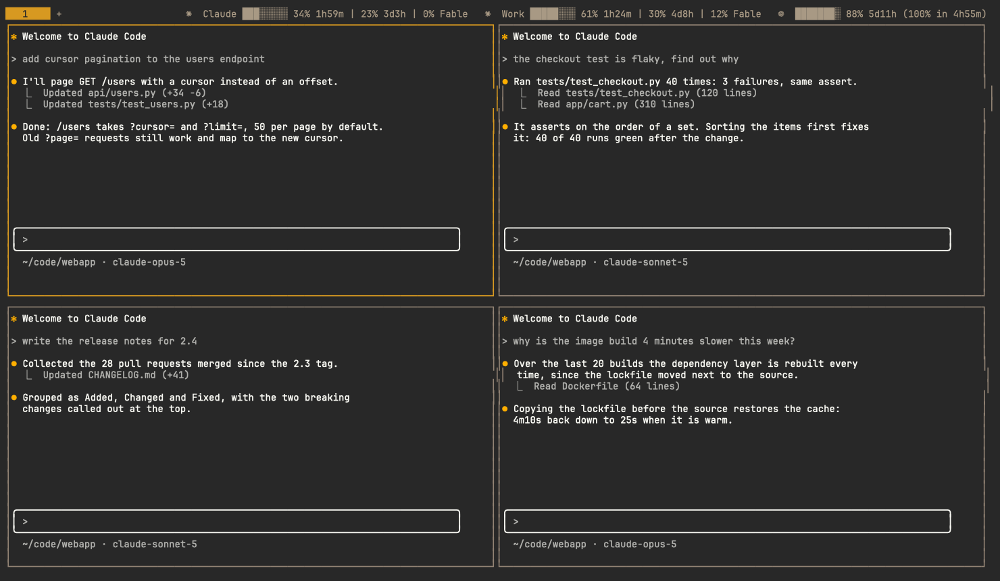

# Usage Tracker for Herdr

**Every account, every limit window, every agent — and not one credential read.**

[](https://github.com/OWNER/herdr_agents_tracker/actions/workflows/tests.yml)
[](https://herdr.dev)
[](https://www.python.org/downloads/)
[](LICENSE)

See how much of your AI subscriptions you have used, without leaving Herdr: in the tab bar, under
each agent, and in a dashboard. Supports Claude Code, Codex, OpenCode Go and Grok.



*Screenshots use demo accounts and made-up numbers; the agent panes are mock sessions.*

## What it shows

- **Tab bar** — one entry per account: logo, bar, % used and time until reset, one group per limit
  window. A model's own limit shows its name instead of a time (`0% Fable`).

  

- **A context meter per agent** — how full each Claude Code and Codex pane's context window is,
  in Herdr's Agents panel: grey, yellow from 70%, red from 90%.

  

- **Pace** — `(100% in 4h05m)` when a limit is on course to run out before it resets.
- **Alerts** — a Herdr notification when a limit passes 80% and 95%, once per window.
- **Dashboard** — every window, token history, a heatmap, and totals by account, model and project.
- **Several accounts per provider** — never merged; each keeps its own cache and history.
- **Honest states**, never a misleading 0%: `…` first refresh · `n/a` no data source ·
  `sign-in needed` · `error` · `(3h00m old)` stale · `~21%` estimate · `-- (reset)`.

Token counts only: no prices and no spend estimates. Limits come from each tool itself, so no
credentials are read — see [What it reads](#what-it-reads).

## Requirements

- Herdr 0.8.2 or newer.
- Python 3.11+, standard library only. macOS still ships 3.9, so install a newer one
  (`brew install python`); the install stops with a message if none is found.
- macOS or Linux.
- Herdr itself is not modified: this is a plugin.

## Install

```sh
herdr plugin install OWNER/herdr_agents_tracker                   # shows a preview; confirm it
herdr plugin action invoke setup --plugin herdr_agents_tracker    # setup guide, applies on "y"
```

Setup shows its plan first, then:

- adds three `tab_bar_right` command entries and a `prefix+u` shortcut to Herdr's `config.toml`;
- adds the context meter to `[ui.sidebar.agents] rows`;
- writes a starter plugin config listing the accounts it found;
- wraps your Claude Code `statusLine` command so Claude's own limit numbers are saved (your
  command still runs, unchanged);
- reloads Herdr's config — Herdr is not restarted and running agents are untouched.

Every line it writes ends with `# usage-tracker`, each file is backed up first, and running setup
again changes nothing. From a clone: `herdr plugin link /path/to/clone`, then
`bin/usage-tracker setup --claude-statusline --apply`.

## Use

- **Dashboard**: `prefix+u` (`ctrl+b` then `u`) or the **Usage: open dashboard** action. It opens
  as a popup; `q` closes it and your layout is untouched.
  Keys: `r` refresh · `↑↓`/`jk` scroll · `t w m a` today / 7 days / 30 days / all · `f` account ·
  `p` provider · `?` help.

  

  

- **Actions**: open dashboard · refresh now · show diagnostics · setup guide.
- **CLI**: `bin/usage-tracker status | refresh | dashboard | diagnostics | setup | uninstall`.
- **Refreshing**: the tab bar reads a local cache every 30 s; limits are re-read every 5 minutes,
  and right after an agent finishes a turn unless Claude's statusLine just reported them.

## Configure

Your config is `~/.config/herdr/plugins/config/herdr_agents_tracker/config.toml`
(`herdr plugin config-dir herdr_agents_tracker`); [`config.example.toml`](config.example.toml)
lists every option.

- `[[profiles]]` — one per account, each with its own `dir` (`CLAUDE_CONFIG_DIR`, `CODEX_HOME`, …).
  With none set, `~/.claude`, `~/.codex` and `~/.local/share/opencode` are used. Grok is opt-in.
- `label`, `icon` — what the tab bar shows for an account. With a Nerd Font,
  `icon = "\uEC82"` and `"\uEC81"` are the Claude and OpenAI logos; short labels keep the bar
  compact.
- `status.format` — `compact` (one window), `detailed` (all windows) or `split` (5-hour and weekly
  in one bar). Also per profile.
- `status.bar` — `blocks`, `color` (🟩 🟨 🟥) or `none`; `status.bar_width` in columns.
- `status.order`, `status.window` — which accounts appear, and which window `compact` shows.
- `status.max_width` (120) — room for the whole summary. Herdr hides it if it does not fit beside
  the tabs, so when space runs short the bar drops model limits, then reset times, then bars;
  every account stays visible.
- `alerts.thresholds` (`[80, 95]`; `[]` turns alerts off). Alerts need Herdr's `[ui.toast]
  delivery` set to `"herdr"` or `"system"`.
- `context.icon` (`⛁`) and `refresh.interval_seconds` (300).

## Providers

| Provider | Limits it shows | Where they come from | Tested |
|---|---|---|---|
| Claude Code | 5h, 7d, per-model weekly (Fable, Sonnet), plan | Claude Code itself (`claude -p` answering `get_usage`) and your statusLine, which reports the 5h and 7d windows while you work | **Live** |
| Codex | Every window Codex reports, plan | `codex app-server` → `account/rateLimits/read`, or the last snapshot in a session log | **Live** |
| OpenCode Go | **Estimated** 5h / 7d / 30d spend against the published Go caps | Costs recorded in the local `opencode.db`; the official meter is not read, and other machines are missing | Fixtures only |
| Grok | Weekly credit %, monthly usage | Grok's billing endpoint, using the Grok CLI's stored sign-in. **Opt-in** | Fixtures only |

Token history (per model, project and session) comes from the local session records of Claude Code,
Codex and OpenCode. API-key accounts never get invented subscription limits.

## What it reads

Everything is a local file or the provider's own CLI. The plugin makes no network request of its
own except for Grok, which is opt-in, and sends nothing anywhere: no telemetry.

| Source | What is taken from it |
|---|---|
| Claude transcripts, `<dir>/projects/**/*.jsonl` | Token counts, model, timestamp, session and project directory — for history and the context meter. Never the text of prompts or replies. |
| `<dir>/sessions/<pid>.json` | The session id of a running `claude`, to find its transcript. The `.key` files beside it are never opened. |
| `<dir>/settings.json` | Only the `statusLine` entry, and only when setup or uninstall changes it. |
| `claude -p --safe-mode --no-session-persistence` | Answers `get_usage`: the limits and plan. Claude Code signs itself in; no prompt is sent and no session is saved. |
| Claude Code's statusLine input | Only `rate_limits` and `context_window`. |
| Codex sessions, `<dir>/sessions/**/rollout-*.jsonl` | Token counts, model, timestamps, session and project path. |
| `codex app-server` | One `account/rateLimits/read` request. Codex signs itself in; its `auth.json` is not read. |
| OpenCode's `opencode.db` | Token counts per session, and the costs its Go allowance is estimated from. Read-only. |
| `~/.grok/auth.json` (**opt-in**) | The Grok CLI's sign-in, held in memory for one billing request. Never written or logged. |
| Herdr's `config.toml` and CLI | The marked setup lines, the agent list, a pane's processes, the meters, notifications. |

Never read: `~/.claude/.credentials.json`, Codex's `auth.json`, the macOS Keychain, browser
cookies, or the content of any conversation. The plugin never switches the account an agent uses.

It writes its own state (`~/.local/state/herdr/plugins/herdr_agents_tracker`), the marked lines in
Herdr's `config.toml`, and the `statusLine` wrapper in Claude's `settings.json`.

## What the numbers mean

- **Limits** are what each provider reports for the whole account, including use outside Herdr.
  Windows are shown separately, never summed or averaged.
- **Token activity** comes from session records on this machine only, so it can be incomplete.

## Update

```sh
herdr plugin install OWNER/herdr_agents_tracker                 # latest
herdr plugin install OWNER/herdr_agents_tracker --ref v0.1.0    # a specific version
```

Your settings are kept, and setup can be re-run safely. [CHANGELOG.md](CHANGELOG.md) lists what
changed per release.

## Remove

```sh
root=$(herdr plugin list --plugin herdr_agents_tracker --json | python3 -c 'import json,sys; print(json.load(sys.stdin)["result"]["plugins"][0]["plugin_root"])')
"$root/bin/usage-tracker" uninstall                  # dry run: shows what would go
"$root/bin/usage-tracker" uninstall --apply          # remove the config lines, restore statusLine, unregister
"$root/bin/usage-tracker" uninstall --apply --purge  # also delete the plugin's config and state
```

It backs up each file first and removes only the lines marked `# usage-tracker`.

## Troubleshooting

- Run **Usage: show diagnostics** (or `bin/usage-tracker diagnostics`): it shows each account's
  source, last attempt, errors, next refresh, history coverage and the state of the integration.
  Credentials are never shown.
- Collector log: `~/.local/state/herdr/plugins/herdr_agents_tracker/collector.log`.
- Nothing in the tab bar? Herdr hides the summary when it does not fit beside the tabs — try a
  smaller `status.max_width` or a shorter `status.format`.

## Development

- Tests: `python3 -m unittest discover -s tests` (synthetic fixtures and temporary directories;
  they never touch real accounts or Herdr config).
- [docs/internals.md](docs/internals.md) — how it works, the modules, adding a provider, and the
  Herdr 0.8.2 behavior this builds on.

## License

MIT. Data-source research drew on
[senna-lang/herdr-agent-usage](https://github.com/senna-lang/herdr-agent-usage) (MIT, © 2026 senna)
and on Orca's usage view as a behavioral reference; no code from either is included.
