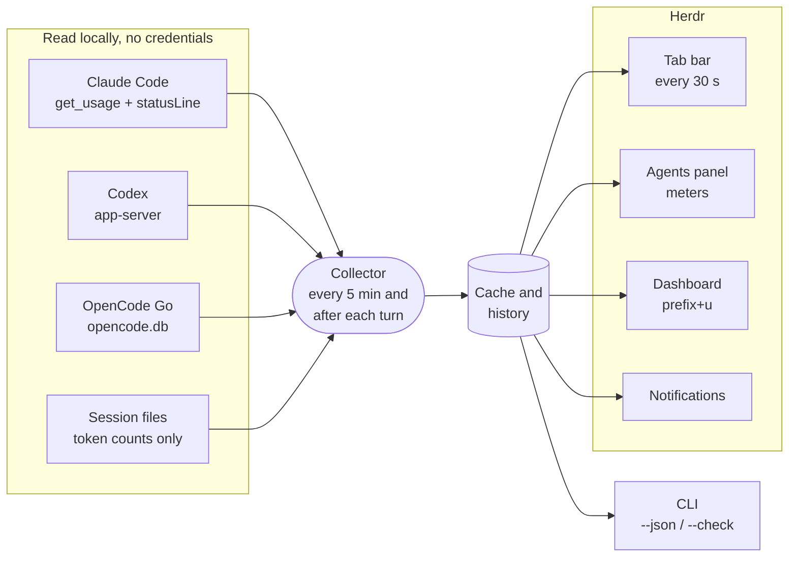

<div align="center">


<a href="#why-this-one"></a>

[](https://github.com/VHemanth45/herdr_agents_tracker/actions/workflows/tests.yml)
[](https://herdr.dev)
[](https://www.python.org/downloads/)
[](LICENSE)

[](#providers)
[](#providers)
[](#providers)
[](#providers)
[](#providers)
[](#providers)
[](#providers)
[](#providers)
[](#install)
[](#privacy-what-it-reads)

<b><a href="#why-this-one">Why</a> · <a href="#everything-it-answers">Features</a> · <a href="#install">Install</a> · <a href="#use">Use</a> · <a href="#configure">Configure</a> · <a href="#providers">Providers</a> · <a href="#privacy-what-it-reads">Privacy</a> · <a href="#faq">FAQ</a></b>

<br>


<sub>Screenshots use demo accounts and made-up numbers.</sub>

</div>

## Why this one

<table>
<tr>
<td width="50%" valign="top">

#### A time, not just a percentage
Other trackers tell you **52% used**. This one also tells you **when you'll hit 100%** at your
current pace:

```
Claude ████░░░░░░ 52% 2h12m (100% in 1h40m)
```

It goes by the last hour of work, not the average since the window opened, so a sudden burst
shows up straight away.

</td>
<td width="50%" valign="top">

#### Usage per agent
Running five agents at once? Each one's context meter shows **its own part of the limit**:

```
⛁ 28% 72k · ~12% of 5h
⛁ 15% 148k · ~2% of 5h
```

No more guessing which pane used up your 5-hour window.

</td>
</tr>
<tr>
<td width="50%" valign="top">

#### Warned before, told after
A notification at **80%** and **95%**, and another when the limit **resets**. Agents that stopped
at the limit show when it resets and are named when it does. They can also be resumed for you
(opt-in).

```
Claude 5h limit has reset
Waiting on it: api server, web. They can go on.
```

</td>
<td width="50%" valign="top">

#### Nothing to leak
**It reads no credentials** for Claude or Codex: it asks those tools themselves. It never reads
prompts or replies, sends no telemetry, and has no dependencies beyond Python's standard library.
It's a plugin: Herdr's own code is never modified.

</td>
</tr>
</table>

## Everything it answers

| You want to know… | Where to look | What you see |
|---|---|---|
| How much of each account have I used? | **Tab bar**, always visible | `Claude ██░░ 13% 35m \| 2% 6d11h \| 0% Fable` |
| Will I run out before it resets? | Tab bar and dashboard | `(100% in 1h40m)` · `on pace for 64% at the reset` |
| Which agent is using the limit? | **Agents panel**, per pane | `⛁ 28% 72k · ~12% of 5h` |
| How full is this agent's context? | Agents panel (grey, then yellow from 70%, red from 90%) | `⛁ 84% 216k` |
| When can a stopped agent go on? | Agents panel, then a notification | `limit · resets 22:20` |
| How has usage grown this window? | **Dashboard** trend line | `▁▁▂▃▃▅▆▇` |
| Where did my tokens go? | Dashboard | by day · account · model · project · session, plus a heatmap |
| Can my scripts check it? | CLI | `status --json` · `status --check 90` → exit `10` |

## How it works



## A closer look

### Tab bar: all accounts at a glance

One entry per account: logo, bar, % used and time until reset, for every limit window. A model's
own limit shows its name (`0% Fable`). When the tab bar runs short of room, it drops model limits,
then reset times, then bars, but every account stays visible.


### Agents panel: a meter under every agent


Under each Claude Code and Codex agent:

- **Context meter**: how full its context window is, coloured by level.
- **Its part of the limit**: `~12% of 5h`, updated after every turn.
- **Stopped at a limit?** The meter shows `limit · resets 22:20` instead. A minute after the
  reset, one notification names every agent that was waiting.

<br clear="right">

### Dashboard: `prefix+u`

Every limit with its bar, pace and a **trend line across the window**, then your token history:
today, 7 days, 30 days or all time, with a daily heatmap and totals by account, model, project
and session.


### Numbers you can trust

It never shows a misleading **0%**. Every state has its own label:

| You see | It means |
|---|---|
| `…` | First refresh still running |
| `~21%` | An estimate (e.g. OpenCode Go, from local records) |
| `(3h00m old)` | Stale data, with its age |
| `-- (reset)` | The window reset and hasn't been read again yet |
| `sign-in needed` · `n/a` · `error` | The account needs attention (details in diagnostics) |

> [!TIP]
> Several accounts per provider are fine (personal and work, say): each keeps its own cache,
> history and alerts, and they're never merged.

## Install

> [!IMPORTANT]
> **Requirements:** Herdr 0.8.2+ · Python 3.11+ · macOS or Linux.
> macOS ships Python 3.9, so run `brew install python` once; the install stops with a message if
> no 3.11+ is found.

```sh
# 1. Install the plugin (shows a preview; confirm it)
herdr plugin install VHemanth45/herdr_agents_tracker

# 2. Run the setup guide (shows its plan; applies when you answer "y")
herdr plugin action invoke setup --plugin herdr_agents_tracker
```

That's it. Setup:

- adds the tab-bar summary, a `prefix+u` dashboard key and a `prefix+shift+u` refresh key;
- adds the context meter to the Agents panel;
- writes a starter config listing the accounts it found;
- wraps your Claude Code `statusLine` so Claude's own limit numbers are saved (your command still
  runs, unchanged);
- reloads Herdr's config without restarting Herdr or touching running agents.

> [!NOTE]
> Every line setup writes ends with `# usage-tracker`, every file is backed up first, and running
> it again changes nothing.

<details>
<summary><b>Install from a clone instead</b></summary>

```sh
git clone https://github.com/VHemanth45/herdr_agents_tracker.git
cd herdr_agents_tracker
herdr plugin link "$PWD"
bin/usage-tracker setup --claude-statusline --apply
```

</details>

## Use

| Keys | What it does |
|---|---|
| `prefix+u` (`ctrl+b` `u`) | Open the dashboard as a popup; `q` closes it and your layout is untouched |
| `prefix+shift+u` | Re-read every account now (the tab bar shows it within 30 s) |
| In the dashboard | `r` refresh · `↑↓`/`jk` scroll · `t w m a` today / 7 d / 30 d / all · `f` account · `p` provider · `?` help |

Herdr's action menu also has **Usage: open dashboard · refresh now · show diagnostics · setup guide**.

**How fresh is it?** The tab bar reads a local cache every 30 s. Limits are re-read every
5 minutes and right after an agent finishes a turn. Claude's `statusLine` reports its 5h and 7d
limits as you work.

### For scripts

```sh
usage-tracker status --json                    # every account's limits and forecast, as JSON
usage-tracker status --check 90 --profile claude || echo "Claude is nearly out"
```

| `--check [PCT]` exit code | Meaning |
|---|---|
| `0` | Every limit below PCT (default 80) |
| `10` | A limit is at PCT% or more |
| `11` | A limit is used up |
| `20` | No account has fresh data |

Plain `status` (what the tab bar runs) always exits `0`, so the tab bar is never hidden by it.

## Configure

Your config: `~/.config/herdr/plugins/config/herdr_agents_tracker/config.toml`
(`herdr plugin config-dir herdr_agents_tracker`). [`config.example.toml`](config.example.toml)
lists every option with comments.

<details>
<summary><b>All options</b></summary>

| Option | Default | What it does |
|---|---|---|
| `[[profiles]]` | auto-detected | One per account, each with its own `dir` (`CLAUDE_CONFIG_DIR`, `CODEX_HOME`, …). With none set, `~/.claude`, `~/.codex`, `~/.local/share/opencode`, `~/.copilot` and `~/.local/share/amp` are used. Gemini, Cursor and Grok are opt-in. |
| `label`, `icon` | provider name | What the tab bar shows. With a Nerd Font, `""` / `""` are the Claude / OpenAI logos. |
| `status.format` | `compact` | `compact` (one window), `detailed` (all windows) or `split` (5h and weekly in one bar). Also per profile. |
| `status.bar`, `status.bar_width` | `blocks`, 10 | `blocks`, `color` (coloured squares) or `none`; width in columns. |
| `status.order`, `status.window` | all, `max` | Which accounts appear, and which window `compact` shows. |
| `status.max_width` | 120 | Room for the whole summary; detail is dropped to fit. |
| `alerts.thresholds` | `[80, 95]` | % used that triggers a notification; `[]` turns alerts off. |
| `alerts.on_reset` | `true` | Also say when a limit you were alerted about resets. |
| `context.icon` | `⛁` | Symbol before each context meter. |
| `context.share` | `true` | Show each agent's part of the limit (`~12% of 5h`). |
| `resume.enabled`, `resume.prompt` | `false`, `"continue"` | Send that prompt to agents that stopped at a limit, once it resets, and only if they're still idle at the limit error. |
| `refresh.interval_seconds` | 300 | How often limits are re-read. |

Notifications follow Herdr's `[ui.toast] delivery`, which must be `"herdr"` or `"system"`.

</details>

## Providers

| Provider | Limits it shows | Where they come from | Tested |
|---|---|---|---|
| **Claude Code** | 5h, 7d, per-model weekly (Fable, Sonnet), plan | Claude Code itself (`claude -p` answering `get_usage`) and your statusLine |  |
| **Codex** | Every window Codex reports, plan | `codex app-server` → `account/rateLimits/read`, or the last snapshot in a session log |  |
| **OpenCode Go** | **Estimated** 5h / 7d / 30d spend against the published Go caps | Costs in the local `opencode.db` (the official meter isn't read) |  |
| **GitHub Copilot CLI** | Monthly premium requests (chat and completions on Copilot Free), plan | `gh api /copilot_internal/user`: the account `gh` is signed in to |  |
| **Amp** | Amp Free (daily), subscription or tier usage, plan | `amp usage` |  |
| **Gemini CLI** | Daily quota per model (Pro, Flash, …), plan | Google's Code Assist quota with the Gemini CLI's sign-in. Google sign-in accounts on a Code Assist plan only (Google stopped serving personal accounts through Gemini CLI in 2026). **Opt-in** |  |
| **Cursor** | Included usage of the billing cycle: total, Auto and API, plan | Cursor's dashboard service with Cursor's sign-in. No token history (Cursor keeps none on disk). **Opt-in** |  |
| **Grok** | Weekly credit %, monthly usage | Grok's billing endpoint with the Grok CLI's sign-in. **Opt-in** |  |

Limits are account-wide, so they include use outside Herdr. Windows are shown separately and never
summed. Token history comes from session records on this machine only. API-key accounts never get
invented subscription limits, and no prices or spend estimates are shown.

## Privacy: what it reads

Everything is a local file or the provider's own CLI. The plugin makes **no network request of its
own** (except the opt-in Gemini, Cursor and Grok) and **sends nothing anywhere**.

> [!CAUTION]
> **Never read:** `~/.claude/.credentials.json`, Codex's `auth.json`, the GitHub CLI's or Amp's
> sign-in, the macOS Keychain, browser cookies, or the content of any conversation. It never switches the account an agent uses, and
> it types into an agent only if you turn on `[resume]`, and then only the resume prompt, once per
> reset.

<details>
<summary><b>Every source, and what is taken from it</b></summary>

| Source | What is taken from it |
|---|---|
| Claude transcripts, `<dir>/projects/**/*.jsonl` | Token counts, model, timestamp, session, project directory, and whether the last reply was the limit error. Never the text of prompts or replies. |
| `<dir>/sessions/<pid>.json` | The session id of a running `claude`, to find its transcript. The `.key` files beside it are never opened. |
| `<dir>/settings.json` | Only the `statusLine` entry, and only when setup or uninstall changes it. |
| `claude -p --safe-mode --no-session-persistence` | Answers `get_usage`: the limits and plan. Claude Code signs itself in; no prompt is sent and no session is saved. |
| Claude Code's statusLine input | Only `rate_limits` and `context_window`. |
| Codex sessions, `<dir>/sessions/**/rollout-*.jsonl` | Token counts, model, timestamps, session, project path, and whether a limit was reached. |
| `codex app-server` | One `account/rateLimits/read` request. Codex signs itself in; its `auth.json` is not read. |
| OpenCode's `opencode.db` | Token counts per session, and the costs its Go allowance is estimated from. Read-only. |
| `~/.grok/auth.json` (**opt-in**) | The Grok CLI's sign-in, held in memory for one billing request. Never written or logged. |
| Copilot's `session-store.db`, `session-state/*/events.jsonl` | Token counts, model, timestamp, session and project directory. Read-only. |
| `gh api /copilot_internal/user` | Copilot's quota and plan. The GitHub CLI signs itself in; no token is read. |
| `amp usage`, Amp's `threads/T-*.json` | The balance text Amp prints; token counts, model, timestamp and project from thread files. `secrets.json` is not read. |
| Gemini CLI's `tmp/*/chats/**` session files | Token counts, model, timestamp, session and project directory. |
| `~/.gemini/oauth_creds.json` (**opt-in**) | The access token only, held in memory for the two quota requests. Never refreshed, written or logged. |
| Cursor's `state.vscdb` (**opt-in**) | The access token and plan name, read-only; the token is held in memory for one request. Never refreshed, written or logged. |
| Herdr's `config.toml` and CLI | The marked setup lines, the agent list and each agent's state and title, a pane's processes, the meters, notifications. |

It writes its own state (`~/.local/state/herdr/plugins/herdr_agents_tracker`), the marked lines in
Herdr's `config.toml`, and the `statusLine` wrapper in Claude's `settings.json`.

</details>

## FAQ

<details>
<summary><b>Does it modify Herdr?</b></summary>

No. Herdr's code is untouched: this is a plugin. Setup only adds lines to Herdr's `config.toml`,
each ending with `# usage-tracker`, and `uninstall --apply` removes exactly those lines.
</details>

<details>
<summary><b>Does it work without Claude Code?</b></summary>

Yes. Each provider is independent: use it with Codex, Copilot, Amp, Gemini or any other alone, and accounts you
don't have are simply not shown.
</details>

<details>
<summary><b>How is "~12% of 5h" worked out?</b></summary>

The agent's share of the account's tokens since the 5-hour window opened (its subagents included,
cache reads left out because they count for little against the limit), times the window's % used.
It's an estimate from this machine's session records, hence the `~`. Turn it off with
`context.share = false`.
</details>

<details>
<summary><b>Will it type into my agents?</b></summary>

Only if you set `[resume] enabled = true`. Then, a minute after a limit resets, each agent that
stopped at it is sent `continue`, and only if it's still idle at that limit error. An agent that's
busy, or that you already continued yourself, is left alone.
</details>

<details>
<summary><b>Why Python 3.11 when macOS ships 3.9?</b></summary>

The plugin uses only the standard library, including `tomllib` (added in 3.11), so there is
nothing to `pip install`. Run `brew install python` once; the install stops with a clear message
if no 3.11+ is found.
</details>

<details>
<summary><b>Why does a limit differ from the provider's website?</b></summary>

Limits are re-read every 5 minutes and after each turn, so they can lag briefly. OpenCode Go's
numbers are estimates from local costs.
</details>

## Update, remove, troubleshoot

**Update** (your settings are kept; see [CHANGELOG.md](CHANGELOG.md)):

```sh
herdr plugin install VHemanth45/herdr_agents_tracker
```

**Remove** (backs up each file first and removes only lines marked `# usage-tracker`):

```sh
root=$(herdr plugin list --plugin herdr_agents_tracker --json | python3 -c 'import json,sys; print(json.load(sys.stdin)["result"]["plugins"][0]["plugin_root"])')
"$root/bin/usage-tracker" uninstall                  # dry run: shows what would go
"$root/bin/usage-tracker" uninstall --apply          # remove the config lines, restore statusLine, unregister
"$root/bin/usage-tracker" uninstall --apply --purge  # also delete the plugin's config and state
```

**Something off?**

- Run **Usage: show diagnostics** (or `bin/usage-tracker diagnostics`): each account's source,
  last attempt, errors, next refresh, history coverage and the state of the integration.
  Credentials are never shown.
- Collector log: `~/.local/state/herdr/plugins/herdr_agents_tracker/collector.log`.
- Nothing in the tab bar? Herdr hides the summary when it doesn't fit beside the tabs; try a
  smaller `status.max_width` or `status.format = "compact"`.

## Roadmap

Ideas, not promises. Open an issue to vote for one or to help:

- [ ] **Turns left** per agent: `~9 turns left` before the 5-hour limit, at its recent pace.
- [ ] **Runaway-agent alert**: one agent using a large share of the limit in minutes.
- [ ] **Usage by git branch or worktree**: "feature/login used 23% of this week's limit".
- [ ] **Daily budget** for the weekly limit: `9%/day keeps you under until the reset`.
- [ ] Live testing for OpenCode Go, Copilot, Amp, Gemini, Cursor and Grok.

Adding a provider is one adapter module; [CONTRIBUTING.md](CONTRIBUTING.md) explains how.

## Development

- Tests: `python3 -m unittest discover -s tests` (synthetic fixtures and temporary directories;
  they never touch real accounts or Herdr config).
- [docs/internals.md](docs/internals.md): how it works, the modules, adding a provider, and the
  Herdr 0.8.2 behavior this builds on.

## License

MIT. Data-source research drew on
[senna-lang/herdr-agent-usage](https://github.com/senna-lang/herdr-agent-usage) (MIT, © 2026 senna)
and on Orca's usage view as a behavioral reference; no code from either is included.

<div align="center">

</div>
